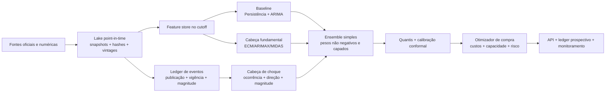

# Análise profunda e plano de evolução do modelo Diesel B S10

**Data de corte da evidência:** 24 de agosto de 2026  
**Escopo:** preço médio semanal nacional e regional do Diesel B S10, horizonte principal de uma semana, previsão de movimento, detecção de choque e decisão de antecipação de compra  
**Status:** diagnóstico e desenho de solução; nenhuma promoção de modelo foi autorizada ou realizada

## Conclusão executiva

O repositório já é uma base de pesquisa e governança acima da média: há walk-forward, baselines, holdout, artefatos versionados, intervalos, gates, ledger, API e experimentos nacionais, regionais e textuais. Porém, **o produto servido ainda não é um modelo combinado de preço + notícias + eventos**. O campeão operacional é o **ARIMA nacional**, e o que os relatórios chamam de “evento” é uma classificação feita *depois do fato*: `|preço realizado - preço de origem| > R$ 0,02/L`. Isso não prova que o sistema antecipou um anúncio ou choque.

A recomendação é:

1. **Manter o ARIMA como incumbente por enquanto.** Nenhum challenger tem evidência prospectiva suficiente para substituí-lo.
2. **Bloquear imediatamente a promoção da paridade.** A especificação congelada na seleção tem duas variáveis, mas a rotina de produção usa quatro; evidência e execução não representam o mesmo modelo.
3. **Corrigir a integridade experimental antes de buscar ganho algorítmico.** Há um erro de ponto flutuante na fronteira de R$ 0,02, lacunas no ledger prospectivo, divergências entre replays ARIMA, imagem Docker incompleta e custos econômicos relevantes zerados por padrão.
4. **Substituir “mais notícias” por um ledger temporal de eventos oficiais.** O sinal de maior valor provável é anúncio estruturado com produto, magnitude, publicação e vigência: preços de lista de produtores/refinarias, reajustes Petrobras, tributos, mistura de biodiesel, subvenções e paradas programadas.
5. **Construir um ensemble causal pequeno e probabilístico:** ARIMA/persistência + cadeia econômica + cabeça de choque/evento. Com cerca de 700 semanas, complexidade e fine-tuning profundo são mais risco que vantagem.
6. **Mudar o objetivo final de preço médio ANP para custo de compra do cliente**, assim que houver notas/faturas, frete, descontos, prazo, capacidade e custo financeiro. A média nacional é um bom índice; não é o custo que a empresa efetivamente paga.

O achado de maior retorno imediato é inesperadamente simples: a ANP obriga produtores e importadores a publicar o preço de lista vigente e os 12 meses anteriores, inclusive para Diesel A S10, por data de vigência, ponto de entrega e modalidade. Essa janela curta torna **urgente arquivar snapshots agora**. É um sinal mais direto que sentimento genérico e está documentado na página oficial de [transparência de preços da ANP](https://www.gov.br/anp/pt-br/assuntos/precos-e-defesa-da-concorrencia/precos/transparencia-de-precos-de-produtores-importadores-e-distribuidores).

## Resposta direta às dúvidas anteriores

- **Existe API?** Sim. Hoje há `/v1/forecast`, `/v1/models`, `/v1/evidence`, `/v1/scenarios/cost`, `/v1/decision`, `/v1/basis`, `/v1/governance` e health checks em [`api.py`](../../src/vs_epl_krls/api.py#L242). Ela ainda não entrega, em um contrato único, todas as métricas por modelo, janela, regime, tolerância, evento, calibração e custo.
- **O repositório contém tudo para reproduzir os números atuais?** Contém código e a maior parte dos artefatos de avaliação, mas não contém todos os corpora/snapshots de notícias nem vintages históricos de todas as fontes externas. Portanto, reproduz bem o estado atual, mas ainda não sustenta um backtest genuinamente point-in-time de eventos.
- **Os eventos estão sendo capturados e aplicados?** No modelo servido, não. “Evento” é atualmente uma semana cujo preço realizado se moveu mais de R$ 0,02/L; é um rótulo ex post em [`performance.py`](../../src/vs_epl_krls/performance.py#L220), não uma notícia ingerida.
- **Há combinação com modelo de notícias?** Houve experimentos de desenvolvimento, protegidos contra vazamento no consumo das matérias, mas nenhum venceu os gates e nenhum está promovido. O melhor caminho é estruturar fatos oficiais, não adicionar um sentimento genérico ao ARIMA.

## 1. O que o sistema efetivamente entrega hoje

### 1.1 Contrato atual

- Alvo principal: preço médio semanal nacional ANP do Diesel B S10.
- Horizonte servido: uma semana.
- Incumbente: ARIMA.
- Holdout nacional: 104 semanas, de 18/08/2024 a 09/08/2026.
- Desenvolvimento: três folds temporais de 52 semanas.
- Regional: modelos em desenvolvimento; o holdout estadual continua fechado.
- Prospectivo: um registro de paridade e um regional, ambos com zero semanas liquidadas no relatório atual.

A publicação da ANP normalmente ocorre na sexta-feira e a coleta acontece quase toda nos três primeiros dias úteis da semana. Logo, o produto precisa declarar se é **forecast pré-semana** ou **nowcast após a coleta ter começado**. A própria [metodologia do levantamento da ANP](https://www.gov.br/anp/pt-br/assuntos/precos-e-defesa-da-concorrencia/precos/precos-revenda-e-de-distribuicao-combustiveis) torna essa distinção necessária.

### 1.2 Resultados nacionais por modelo

Os números abaixo são retrospectivos e vêm do holdout já consultado. Eles **não são nova evidência prospectiva**. Métricas de direção excluem semanas sem movimento; “direção em evento” condiciona a avaliação a um choque que já aconteceu.

| Modelo | Papel atual | MAE (R$/L) | RMSE (R$/L) | sMAPE | Direção | Direção em evento publicada | Dentro de ±R$0,02 | Leitura correta |
|---|---:|---:|---:|---:|---:|---:|---:|---|
| ARIMA | campeão servido | 0,0271 | 0,0815 | 0,412% | 59,2% | 80,0% de 35 | 72,1% | melhor MAE; ganho de RMSE de 14,8% contra persistência, mas DM p=0,1338 |
| Ensemble 70% ARIMA + 30% VS | não promovido | 0,0285 | 0,0842 | 0,433% | 78,9% | 91,4% de 35 | 73,1% | forte direção, pior preço que ARIMA |
| VS-ePL-KRLS | shadow/pesquisa | 0,0336 | 0,0938 | 0,509% | 63,4% | 68,6% de 35 | 67,3% | ganho de RMSE de apenas 1,9% contra persistência; falha gate de 2% |
| Persistência | baseline | 0,0326 | 0,0956 | 0,490% | 0,0% | 0,0% | 66,3% | difícil de superar em semanas quietas |
| Ridge | baseline | 0,0396 | 0,1069 | 0,590% | 38,0% | — | — | pior que persistência |
| Paridade simples | challenger retrospectivo | 0,0275 | 0,0808 | — | 71,8% | 80,0% de 35 | 68,3% | perde MAE e semanas quietas; holdout reutilizado; spec de produção diverge |

Fontes locais principais: [`selection_manifest_h1.json`](../../reports/vs_epl_krls/s10_selection/selection_manifest_h1.json), [`quality_summary.json`](../../reports/vs_epl_krls/s10_product/quality_summary.json), [`s10_performance/manifest.json`](../../reports/vs_epl_krls/s10_performance/manifest.json) e [`s10_parity/manifest.json`](../../reports/vs_epl_krls/s10_parity/manifest.json).

Não se deve transformar 91,4% em “o modelo prevê 91,4% dos choques”. Esse número é 32 acertos direcionais em apenas 35 choques já identificados pelo valor realizado; o intervalo de Wilson de 95% é aproximadamente 77,6%–97,1%, e não há contagem de falsos alarmes de detecção de choque nessa métrica.

### 1.3 Resultado regional

No desenvolvimento do Rio Grande do Sul:

| Modelo | Janela | MAE | Direção | Direção em evento | Situação |
|---|---:|---:|---:|---:|---|
| Nacional + spread RS | 156 semanas de desenvolvimento | 0,0573 | 69,6% | 74,7% | melhor candidato regional; sem teste cego |
| RS direto | 156 semanas de desenvolvimento | 0,0594 | 65,2% | 69,0% | inferior ao nacional + spread |
| Persistência RS | mesma janela | 0,0597 | 0,0% | 0,0% | baseline |

Esses resultados não podem ser comparados diretamente ao holdout nacional. O artefato regional é explicitamente *development-only*, tem poucos episódios extremos e ainda herda a especificação nacional de paridade divergente.

## 2. Bloqueadores encontrados na auditoria

### 2.1 Prioridade zero: evidência e produção não representam o mesmo challenger

O script de seleção congela `paridade = (dp1, rpar1)` em [`22_s10_parity_selection.py`](../../scripts/22_s10_parity_selection.py#L48), e o manifesto confirma duas features nas linhas 456–460. Porém, [`PARITY_FEATURES`](../../src/vs_epl_krls/passthrough.py#L60) contém `(dp1, rpar1, rpar2, coint_par)`, e a produção usa essa constante em [`23_s10_parity_production.py`](../../scripts/23_s10_parity_production.py#L174). O forecast salvo também registra as quatro variáveis.

As duas especificações têm resultados diferentes:

| Especificação | Features | RMSE | MAE | Direção | Gatilhos | Precisão do gatilho | “Economia” a custo zero |
|---|---|---:|---:|---:|---:|---:|---:|
| congelada | `dp1, rpar1` | 0,080807 | 0,027521 | 71,8% | 26 | 65,4% | R$ 19.385 |
| executada | `dp1, rpar1, rpar2, coint_par` | 0,080415 | 0,028376 | 73,2% | 30 | 60,0% | R$ 18.808 |

**Impacto:** o hash do artefato garante integridade do arquivo, mas não garante que ele implementa a hipótese que passou pelos gates. Isso também afeta a base nacional dos scripts regionais.

**Correção obrigatória:** a produção deve ler a lista exata `frozen_spec_features` do manifesto assinado, materializá-la no artefato e abortar se `manifest_features != artifact_features != runtime_features`. O ledger atual de paridade deve ser reclassificado e reemitido depois da correção; não pode sustentar promoção.

### 2.2 Prioridade zero: a imagem Docker não serve a arquitetura documentada

O [`Dockerfile`](../../Dockerfile#L12) instala `.[production,service]` a partir de limites abertos do `pyproject.toml`, embora exista `requirements-service.lock`. Ele copia o artefato nacional, `s10_product` e o manifesto de seleção, mas não copia paridade, gates, estados e seus ledgers. O serviço então omite silenciosamente o que não encontra em [`15_s10_service.py`](../../scripts/15_s10_service.py#L70).

**Impacto:** o container pode responder normalmente enquanto não possui challenger, gate ou regional; além disso, versões de dependências podem divergir das usadas para validar o release.

**Correção obrigatória:** instalar o lock transitivo, preferencialmente com hashes e o pacote em `--no-deps`; copiar um *release bundle* autocontido; e testar a imagem construída contra `/v1/governance`, `/v1/models`, estados esperados e versões exatas.

### 2.3 Prioridade zero: o ledger prospectivo pode perder previsões

[`audit.py`](../../src/vs_epl_krls/audit.py#L117) liquida apenas o último registro emitido. Se houver duas previsões pendentes e ambas já forem observáveis, a anterior pode nunca ser liquidada. O append do hash-chain também não tem trava de arquivo/atomicidade. Além disso, [`31_s10_performance.py`](../../scripts/31_s10_performance.py#L153) calcula a direção prospectiva com uma expressão que não compara corretamente os sinais previsto e realizado.

**Correção obrigatória:** liquidar todas as previsões pendentes elegíveis por `target_date`, recuperar a origem pelo hash do forecast, comparar `sign(point-origin)` com `sign(actual-origin)`, usar escrita atômica e lock. Um teste deve criar duas pendências observáveis e exigir duas liquidações, sem duplicidade após reexecução.

### 2.4 Prioridade alta: o limiar de evento é instável em `float`

O código usa `abs(move) > 0.02` diretamente em [`gates.py`](../../src/vs_epl_krls/gates.py#L97) e [`performance.py`](../../src/vs_epl_krls/performance.py#L225). Cinco movimentos de exatamente ±R$ 0,02 aparecem como `0.020000000000000462` e são classificados como evento.

| Item | Relatório atual | Aritmética monetária estável |
|---|---:|---:|
| Eventos no holdout | 35 | 30 |
| Semanas quietas | 69 | 74 |
| Direção em evento ARIMA | 80,0% | 83,3% (25/30) |
| Direção em evento ensemble | 91,4% | 93,3% (28/30) |
| Direção em evento VS | 68,6% | 73,3% (22/30) |
| Direção em evento paridade | 80,0% | 83,3% (25/30) |

As datas limítrofes são 15/09/2024, 30/03/2025, 20/04/2025, 02/11/2025 e 14/06/2026. Os gates finais não se invertem, mas contagens, condicionais e narrativa estão errados.

**Correção obrigatória:** representar dinheiro em inteiro de milésimos de real para preservar o histórico antigo, ou `Decimal` com regra explícita. O teste de fronteira deve afirmar: 0,020 é quieto para a regra estrita `> 0,02`; 0,021 é evento.

### 2.5 Prioridade alta: houve uma quebra de medição em maio de 2022

No arquivo [`semanal_s10.csv`](../../data/processed/semanal_s10.csv), o último preço nacional fora da grade de centavos é 01/05/2022 (R$ 6,775). De 08/05/2022 em diante, 224 de 224 observações têm duas casas decimais. A taxa de movimento exatamente zero sobe de 33/478 = 6,90% antes da quebra para 46/223 = 20,63% depois; no holdout, chega a 33/104 = 31,73%.

Isso coincide com a mudança regulatória que passou a exigir duas casas decimais nas bombas; a [FAQ atual da ANP](https://www.gov.br/anp/pt-br/acesso-a-informacao/perguntas-frequentes) mantém essa regra, hoje sob a Resolução 948/2023. A série ingerida mudou de resolução e o pipeline em [`anp.py`](../../src/data/anp.py#L96) não registra o regime.

**Impacto:** parte da “inflação de zeros” é medição/grade de preço, não um fenômeno econômico descoberto pelo modelo. Direção, tolerância de um centavo e persistência não são homogêneas antes e depois da quebra.

**Correção obrigatória:** adicionar `measurement_regime`, avaliar pré/pós-08/05/2022 separadamente, treinar a cabeça de movimento em unidades monetárias discretas e reconstruir, quando útil, a distribuição a partir do [microdado por posto da ANP](https://www.gov.br/anp/pt-br/centrais-de-conteudo/dados-abertos/serie-historica-de-precos-de-combustiveis).

### 2.6 Prioridade alta: “economia líquida” pressupõe custo de carregamento zero

[`procurement.py`](../../src/vs_epl_krls/procurement.py#L77) usa por padrão `carrying_cost_brl_per_liter_week = 0.0`. O backtest não conhece desconto do fornecedor, prazo, custo financeiro, capacidade de tanque, perdas, frete incremental, tributos nem penalidades. Portanto, o valor publicado é **benefício de timing sob cenário de custo zero**, não economia líquida comprovada.

Recalculando a política publicada — 200 mil L/mês, 25% de flexibilidade e 103 semanas acionáveis — a conclusão econômica fica sensível a apenas um centavo por litro por semana:

| Modelo | Total com carry 0 | Total com carry R$0,01/L/sem | Total com carry R$0,02/L/sem | Limite inferior do IC90 anualizado: 0 / 1 / 2 centavos |
|---|---:|---:|---:|---:|
| ARIMA | R$ 16.961,54 | R$ 16.038,46 | R$ 15.115,38 | +R$ 116,50 / −R$ 116,50 / −R$ 407,77 |
| Paridade simples | R$ 19.384,62 | R$ 16.384,62 | R$ 13.384,62 | +R$ 990,29 / −R$ 291,26 / −R$ 1.747,57 |

Com apenas R$0,01/L/sem, ambos os intervalos já incluem resultado anualizado não positivo. O gate econômico precisa usar a diferença semanal pareada, block bootstrap e custos reais pré-registrados; comparar só os totais é insuficiente.

### 2.7 Outras dívidas que impedem uma alegação forte de produção

| Achado | Evidência local | Risco | Correção |
|---|---|---|---|
| Replays ARIMA não são idênticos | seleção, paridade e produção usam históricos/grades ligeiramente diferentes; diferença máxima de R$0,000283/L e um gatilho muda | gates e lucro usam “o mesmo ARIMA” apenas nominalmente | gerar uma tabela OOS canônica por `spec_hash` e reutilizá-la em todos os relatórios |
| Release permissivo | release servido está como `validated_candidate`, artefato 1.1.0; código atual gera 1.2.0 | health pode parecer pronto sem aprovação e compatibilidade de runtime | exigir `release_status=approved`, gates válidos, runtime e schema compatíveis antes de `serving_ready` |
| Caminhos absolutos | manifestos registram `C:\Users\Acer\...` | vazamento de ambiente e baixa portabilidade | usar URI relativa ao bundle + hash; resolver caminho só no runtime |
| Intervalo supercoberto | nominal 80%, holdout 92,3%; largura média R$0,121/L | “cobertura boa” pode ser apenas intervalo largo | avaliar interval score, largura e cobertura rolling/por choque |
| Regional sem cadeia de release | artefato development-only, fontes offline vazias | endpoint estadual pode aparentar maturidade inexistente | manifest/hash/gates/shadow próprios por estado |
| Decisão sem challenger pode parecer concordância | `decision.py` aceita ausência como concordância | confiança alta quando faltou evidência | estado `missing`, jamais `agree`; confiança deve cair |

## 3. Anatomia real do erro

O problema não é errar um pouco toda semana. É errar muito em poucas semanas.

- Sob a máscara publicada, as semanas de evento concentram **98,61% do SSE do ARIMA**.
- As cinco piores semanas concentram **93,52% do SSE**.
- O maior choque isolado concentra **75,11% do SSE**.
- Com a máscara monetária corrigida, o MAE do ARIMA é aproximadamente **R$0,0084/L nas semanas quietas** e **R$0,0731/L nos choques**.
- O maior erro ocorre em 08/03/2026: movimento realizado de aproximadamente +R$0,74/L e erro ARIMA de cerca de R$0,72/L.

Esse episódio é compatível com um choque externo real, não com ruído comum: o [Relatório de Política Monetária do BCB de junho de 2026](https://www.bcb.gov.br/content/ri/relatorioinflacao/202606/rpm202606p.pdf) registra Brent abaixo de US$70 no primeiro bimestre e acima de US$100, em média, entre março e maio; o governo também criou um [programa de subvenção ao diesel em 2026](https://www.gov.br/anp/pt-br/assuntos/precos-e-defesa-da-concorrencia/subvencao-a-comercializacao-de-oleo-diesel-rodoviario-2026). A inferência é que o erro extremo representa uma mudança de regime que o modelo univariado não tinha como antecipar adequadamente.

Eventos também se agrupam: na série completa, a probabilidade empírica de uma nova semana de evento após outra é aproximadamente 62,1%, contra 16,5% após uma semana quieta; a correlação phi de primeira ordem é cerca de 0,46. Isso recomenda **curvas de resposta e duração**, não apenas uma flag isolada.

Consequência: otimizar somente RMSE médio continuará produzindo pequenos ganhos nas semanas fáceis e pouca proteção nas semanas que geram quase todo o risco e valor de compra.

## 4. Por que o modelo atual de notícias não funcionou

O experimento textual não deve ser descartado como código ruim; ele respondeu corretamente que a evidência disponível era fraca.

- Corpus v2: 5.752 documentos, descrito em [`news_integration.md`](../../docs/news_integration.md).
- Desenvolvimento: 156 origens; 94 com alguma notícia; **39,74% sem notícia**.
- Cobertura média das fontes: **27,24%**.
- Baseline sem notícia: RMSE médio 0,104741.
- Melhor variante com notícia: RMSE médio 0,104926 — piora de cerca de 0,18%.
- Melhor classificador de pressão: accuracy 60,26%, balanced accuracy 52,28%, macro-F1 52,30%, Brier 0,627, log loss 1,068 e ECE 0,220.
- Os rótulos foram derivados do movimento futuro do S10, não anotados por humanos; holdout não foi aberto e promoção foi proibida.

Fontes: [`s10_news/manifest.json`](../../reports/vs_epl_krls/s10_news/manifest.json) e [`s10_news_pressure/manifest.json`](../../reports/vs_epl_krls/s10_news_pressure/manifest.json).

As causas mais prováveis são:

1. **Supervisão fraca:** o texto recebe o rótulo do preço posterior; aprende correlação, não o mecanismo econômico do fato.
2. **Baixa cobertura e ausência ambígua:** nenhuma matéria encontrada não significa “nenhum evento”.
3. **Sentimento errado para o alvo:** “petróleo em alta” não informa automaticamente quanto, quando e em qual polo o Diesel B S10 brasileiro mudará.
4. **Relógios misturados:** publicação, vigência e efeito no varejo são datas diferentes.
5. **Duplicação:** várias matérias podem repercutir o mesmo fato oficial.
6. **Amostra pequena:** há cerca de 700 semanas; um modelo textual profundo teria muito mais graus de liberdade que evidência.

O texto deve virar **evento econômico estruturado**. Estudos de extração de eventos em petróleo também distinguem geopolítica, oferta/demanda, produto, polaridade, modalidade e intensidade, em vez de depender só de sentimento ([Lee, Soon & Siew, 2022](https://arxiv.org/abs/2205.00387)). Um encoder pode ajudar como extrator congelado; não deve controlar diretamente a previsão sem ablação e gold set.

## 5. Fontes que realmente valem integrar

### 5.1 Ordem recomendada

| Prioridade | Fonte | Sinal | Momento de disponibilidade e armadilha | Uso recomendado |
|---|---|---|---|---|
| P0 | [ANP — levantamento semanal e microdados](https://www.gov.br/anp/pt-br/centrais-de-conteudo/dados-abertos/serie-historica-de-precos-de-combustiveis) | alvo nacional/UF/posto e dispersão | coleta seg.–qua.; publicação em regra sex.; é alvo, não leading signal | target, medição, dispersão regional, qualidade |
| P0 | [ANP — links de preços de lista](https://www.gov.br/anp/pt-br/assuntos/precos-e-defesa-da-concorrencia/precos/transparencia-de-precos-de-produtores-importadores-e-distribuidores) | preço vigente de Diesel A S10 por agente, polo e modalidade | por evento/vigência; só 12 meses anteriores são obrigatórios; sites dinâmicos | arquivar diariamente; sinal oficial principal |
| P0 | [Petrobras — preços e anúncios](https://precos.petrobras.com.br/) | magnitude e vigência de reajuste por polo | periodicidade indefinida; separar anúncio de vigência | evento estruturado e curva de repasse |
| P1 | [BCB — PTAX via API](https://dadosabertos.bcb.gov.br/pt_BR/dataset/dolar-americano-usd-todos-os-boletins-diarios) | USD/BRL oficial | diário; fechamento só após consultas intradiárias; licença ODbL | paridade causal no cutoff correto |
| P1 | [ANP — PPI](https://www.gov.br/anp/pt-br/assuntos/precos-e-defesa-da-concorrencia/precos/precos-de-paridade-de-importacao) | custo importado por porto/polo | semanal; planilha atualiza história e registra retificações; subjacente S&P | feature fundamental, snapshot por vintage, revisão de licença para redistribuição |
| P1 | [ANP — paradas programadas](https://www.gov.br/anp/pt-br/assuntos/producao-de-derivados-de-petroleo-e-processamento-de-gas-natural/paradas-programadas) | instalação, unidade, início/retorno, motivo e impacto | informado mensalmente para os dois meses seguintes; preservar cada versão | gate geográfico antecipador |
| P1 | CONFAZ, CNPE/MME, Planalto e DOU/INLABS | ICMS, PIS/Cofins, subvenção, mistura de biodiesel | evento jurídico com publicação e vigência distintas; INLABS exige cadastro | eventos determinísticos com datas legais |
| P1 | [ANP — preço de produtor/importador e B100](https://www.gov.br/anp/pt-br/assuntos/precos-e-defesa-da-concorrencia/precos/precos-de-produtores-e-importadores-de-derivados-de-petroleo-e-biodiesel) | cadeia de Diesel A/B100 | semanal, porém aproximadamente 12 dias após a semana e sujeito a revisão | confirmação, regime e modelos h>1; nunca juntar pela data de referência sem lag |
| P1 | [ANP — distribuição](https://www.gov.br/anp/pt-br/assuntos/precos-e-defesa-da-concorrencia/precos/precos-de-distribuicao-de-combustiveis) | estágio intermediário do repasse | semanal/mensal conforme produto; auditar release real | alvo intermediário e spread regional |
| P2 | [EIA — ULSD spot diário](https://www.eia.gov/dnav/pet/PET_PRI_SPT_S1_D.htm) e [WPSR](https://www.eia.gov/petroleum/supply/weekly/schedule.php) | diesel internacional, estoques, refino, importação | spot diário; WPSR normalmente quarta 10h30 ET; revisar redistribuição da série spot | substituir/validar `HO=F`; challenger parcimonioso |
| P2 | NHC/NOAA e INMET | furacões/chuva severa próximos de portos, refinarias e corredores | usar apenas forecasts emitidos naquele instante, não trajetória final | gate de choque geográfico, não feature universal |
| P2 | MME/ANP em crises de abastecimento | estoques, cobertura, déficit, medidas emergenciais | irregular e selecionado por regime; ausência não é zero | extração estruturada durante crise |
| P3 | Comex Stat, produção/importação ANP | dependência externa, origem, porto, volume | mensal, tipicamente M+1 | regimes e pesos regionais; fraco para H+1 |
| Descoberta | mídia ampla/GDELT/RSS | alerta e contexto | duplicada, ambígua, histórico incompleto | localizar o documento oficial; não alimentar o preço diretamente no MVP |

A Petrobras informa que, desde maio de 2023, usa custo alternativo do cliente e valor marginal próprio, sem subordinação obrigatória ao PPI e sem periodicidade definida. Logo, PPI é pressão econômica, não relógio mecânico de reajuste ([estratégia comercial oficial](https://agencia.petrobras.com.br/pt/w/petrobras-aprova-estrategia-comercial-de-diesel-e-gasolina)).

### 5.2 Fontes que exigem cautela

- O PPI histórico disponível hoje não prova o que estava publicado em cada data passada; há retificações. Sem snapshots, o backtest pode usar um vintage futuro.
- A série de futuros `HO=F` usada no repo é conveniente, mas depende de fonte não oficial, roll de contrato e termos de uso. A EIA oferece ULSD diário desde 2006; ainda assim, parte do spot é fornecida por terceiro e a redistribuição deve ser revisada.
- Estoques diários enviados à ANP não foram localizados como série pública agregada.
- Não foi localizado feed oficial estruturado de paradas **não programadas**. Ausência de notícia nunca deve virar `outage=0`.
- ICE/CME oferecem curvas e volatilidade excelentes, mas exigem licença; scraping de página pública não é estratégia de produção.

## 6. Solução proposta: Radar S10, um ensemble causal orientado a eventos



### 6.1 Espinha temporal point-in-time

Cada observação externa precisa registrar:

- `event_time`: quando o fato econômico ocorreu;
- `published_at`: quando o documento foi publicado;
- `available_at`: quando poderia ter sido consumido pelo pipeline;
- `retrieved_at`: quando foi baixado;
- `effective_at` e `end_at`: vigência econômica/legal;
- `source_url`, `document_id`, `document_sha256` e `vintage`;
- `parser_version` e `supersedes`.

Regra inviolável: uma feature só pode entrar se `available_at <= forecast_cutoff`. Para uma parada anunciada ou imposto futuro, a informação pode ser conhecida antes de `effective_at`; para uma surpresa, ela só existe após `published_at`.

Vintages não são detalhe: revisões e lacunas de publicação alteram resultados de forecast em tempo real ([Croushore & Stark, 2000](https://papers.ssrn.com/sol3/papers.cfm?abstract_id=244554)).

### 6.2 Contrato do alvo

Separar dois produtos:

| Produto | Emissão sugerida | Dados permitidos | Alvo | Uso |
|---|---|---|---|---|
| Forecast H+1 pré-semana | sexta após a publicação ANP da origem, em horário fixo | tudo publicado até o cutoff | próxima semana de coleta | decisão de compra antecipada |
| Nowcast da semana corrente | após um ou mais dias úteis | dados que surgiram durante a própria semana | semana em andamento | monitoramento; não comparar ao forecast pré-semana |

A API deve publicar `as_of`, `forecast_cutoff`, `target_collection_start`, `target_collection_end`, `forecast_type` e `data_freshness`.

### 6.3 Três cabeças de modelo

**Baseline.** Manter persistência e ARIMA. Eles são a régua e uma defesa contra challengers frágeis.

**Fundamental.** ECM/ARIMAX regularizado de baixa dimensão, com poucos sinais fortes: paridade corrente no cutoff, PTAX, Diesel A/list price, distribuição, B100/mistura, tributos e regimes observáveis. Para diário → semanal, comparar agregação simples com MIDAS parcimonioso; a metodologia MIDAS foi criada exatamente para regressões de frequências mistas ([Andreou, Ghysels & Kourtellos, 2010](https://www.sciencedirect.com/science/article/pii/S0304407610000072)).

**Choque/evento.** Um hurdle assinado:

1. `P(quiet)`, `P(up)` e `P(down)`;
2. quantis da magnitude condicionada à classe;
3. reconstrução de `E[Δp] = P(up)E[m_up] - P(down)E[m_down]`;
4. curvas de resposta h=0…4 por classes amplas de evento.

Curvas por horizonte podem ser estimadas com projeções locais, que reduzem a dependência de uma dinâmica única e rígida ([Jordà, 2005](https://doi.org/10.1257/0002828053828518)). Com poucos eventos, agrupar em Petrobras/preço na origem, tributo/subvenção, biodiesel e logística/refino; não criar dezenas de subtipos.

### 6.4 Ensemble e incerteza

Combinar apenas modelos com mecanismos diferentes: baseline, fundamental e choque. Testar média simples e pesos não negativos, soma 1 e teto por componente; estimar pesos somente no inner rolling window.

Entregar P10/P50/P90, `P(up)`, `P(down)`, `P(|Δ|>δ)` e calibração. Scores próprios como Brier, log score, CRPS e pinball impedem probabilidades artificialmente confiantes ([Gneiting & Raftery, 2007](https://doi.org/10.1198/016214506000001437)). Para os intervalos, comparar quantil empírico rolling, EnbPI e Adaptive Conformal. Esses métodos são wrappers de incerteza, não fontes de precisão; EnbPI trata dependência temporal aproximadamente ([Xu & Xie, 2021](https://proceedings.mlr.press/v139/xu21h.html)) e Adaptive Conformal ajusta cobertura sob mudança de distribuição ([Gibbs & Candès, 2021](https://proceedings.neurips.cc/paper/2021/hash/0d441de75945e5acbc865406fc9a2559-Abstract.html)).

### 6.5 Ledger de eventos

Schema mínimo:

```json
{
  "event_id": "sha256:...",
  "source": "petrobras",
  "source_url": "https://...",
  "document_sha256": "...",
  "published_at": "2026-...-...T...-03:00",
  "available_at": "2026-...-...T...-03:00",
  "effective_at": "2026-...-...T00:00:00-03:00",
  "end_at": null,
  "actor": "Petrobras",
  "product": "diesel_a_s10",
  "delivery_point": "...",
  "geography": "BR/UF/polo",
  "event_type": "list_price_change",
  "direction": "down",
  "magnitude_brl_per_liter": -0.15,
  "confidence": 1.0,
  "parser_version": "events-v1",
  "supersedes": null
}
```

Pipeline recomendado:

1. baixar HTML/XLSX/XML/PDF e guardar o documento imutável;
2. extrair magnitude, unidade, produto, polo, publicação e vigência com regras determinísticas sempre que possível;
3. usar LLM apenas como assistente de extração para layouts variáveis;
4. validar unidade, faixa, data e consistência com fonte anterior;
5. enviar baixa confiança para revisão humana;
6. deduplicar repercussões pelo documento/fato canônico;
7. materializar somente features permitidas no cutoff.

Para texto amplo, criar um gold set inicial de cerca de 300 candidatos, dois anotadores e adjudicação. Os rótulos devem descrever o fato e o mecanismo esperado, nunca ser derivados do preço futuro.

## 7. Um experimento de alto valor já apareceu na auditoria

O pipeline causal alinha o último valor diário conhecido antes da data semanal, mas [`build_parity_panel`](../../src/vs_epl_krls/passthrough.py#L257) aplica outro `shift(1)`. Na operação de 24/08/2026, a previsão para a semana de 23/08 ainda usa a paridade da linha de 16/08, apesar de já existirem dados diários mais recentes. Há forte indício de **sinal desnecessariamente envelhecido em uma semana**.

Foi feito um diagnóstico exploratório somente nos três folds de desenvolvimento, sem tocar o holdout, adicionando `rpar0` — a mudança de paridade disponível no cutoff atual — junto de `rpar1`:

| Variante | RMSE médio | MAE médio | Direção média |
|---|---:|---:|---:|
| congelada `dp1 + rpar1` | 0,100760 | 0,050950 | 72,03% |
| exploratória `dp1 + rpar0 + rpar1` | 0,100176 | 0,049793 | 78,06% |
| diferença | −0,58% | −2,27% | **+6,03 p.p.** |

O MAE melhorou nos três folds. Isso **não é candidato promovível**: usa o snapshot atual, ainda não possui vintages históricos e foi proposto após ver outros resultados. É, contudo, o primeiro challenger que deve ser formalizado quando o cutoff point-in-time estiver pronto. O resultado também mostra que a melhoria mais promissora pode vir de usar melhor o dado causal já disponível, antes de adicionar centenas de notícias.

## 8. Avaliação correta a partir de agora

O holdout nacional de 104 semanas foi consultado mais de uma vez. Deve ser congelado como evidência histórica, nunca mais usado para selecionar ou promover. Validação temporal exige cuidado com dependência e não estacionariedade; K-fold comum não é uma escolha automática para séries temporais ([Bergmeir, Hyndman & Koo, 2018](https://www.sciencedirect.com/science/article/pii/S0167947317302384)).

### 8.1 Protocolo

- Desenvolvimento: expanding-window com inner folds para todo tuning, seleção de features, threshold e pesos.
- Dados: replay point-in-time por vintage e cutoff operacional exato.
- Comparações: perdas semanais pareadas, block bootstrap e controle da multiplicidade de modelos tentados.
- Shadow: mínimo de 52 semanas; continuar até acumular idealmente 30–50 choques monetariamente estáveis.
- Registro: toda família tentada, inclusive as que perderam, entra no catálogo de experimentos.
- Promoção: manual e prospectiva; nunca automática por um único p-value ou métrica.

### 8.2 Métricas que a API e os relatórios devem expor por modelo

| Dimensão | Métricas mínimas | Por quê |
|---|---|---|
| Preço | MAE, RMSE, MASE, bias, mediana AE, ±1/2/5/10 centavos | escala, cauda, viés e utilidade operacional |
| Movimento | matriz up/flat/down, balanced accuracy, macro-F1, MCC | evita inflar acerto pela classe dominante |
| Choque | precision, recall, PR-AUC, false-alarm rate, lead time e direção condicional | mede antecipação e alarmes falsos, não só direção depois do choque |
| Probabilidade | Brier, log loss, CRPS, pinball, reliability/PIT | mede honestidade das probabilidades |
| Intervalo | cobertura, largura, interval/Winkler score, rolling 26/52 e por choque | cobertura isolada premia intervalos largos |
| Decisão | benefício líquido, regret vs oracle/sempre/nunca, CVaR e sensibilidade de custos | conecta forecast à compra real |
| Concentração | contribuição dos top 1/5 eventos ao SSE e ao valor | revela dependência de poucos episódios |
| Operação | freshness, missingness, latência, falha por fonte, drift, versão/hash | permite confiar no forecast emitido |

Reportar tudo por:

- janela e status (`development`, `spent_holdout`, `prospective`);
- regime de medição pré/pós-maio de 2022;
- quieto/choque e subida/queda;
- nacional/UF/polo;
- horizonte h=1, h=4 e h=12;
- versão exata de target, feature set e custos.

### 8.3 Gate econômico

Uma ação deve ser tomada apenas se:

```text
E[benefício líquido | volume, lead time, carry, capacidade, frete, desconto, impostos]
    > margem mínima + buffer de risco
e P(benefício líquido > 0) > limiar pré-registrado
```

O baseline decisório não é apenas “não comprar antes”. Comparar com regras `sempre antecipar`, `nunca antecipar`, política atual da empresa e oracle. A política deve reportar regret, custo de falso positivo e custo de falso negativo.

## 9. API completa proposta

Manter os endpoints atuais e adicionar três contratos canônicos:

### `GET /v1/evaluations`

Filtros: `model_id`, `window`, `status`, `regime`, `geography`, `horizon`, `as_of`. Retorna todas as métricas da seção anterior, denominadores, intervalos, `spec_sha256`, `dataset_vintage_sha256` e custos usados.

### `GET /v1/events`

Filtros por publicação, vigência, produto, tipo, ator, geografia e confiança. Deve diferenciar `world_event`, `realized_shock_week` e `decision_trigger`.

### `GET /v1/data-status`

Para cada fonte: último evento, último sucesso, atraso contra SLA, vintage, hash, missingness, licença/redistribuição e degradação aplicada.

O forecast deve evoluir para algo como:

```json
{
  "as_of": "2026-08-21T18:00:00-03:00",
  "forecast_cutoff": "2026-08-21T17:30:00-03:00",
  "forecast_type": "preweek",
  "target_collection_start": "2026-08-24",
  "target_collection_end": "2026-08-26",
  "model": {"id": "radar_s10_v1", "spec_sha256": "..."},
  "price_brl_per_liter": {"p10": 6.08, "p50": 6.13, "p90": 6.22},
  "movement": {"down": 0.15, "flat": 0.45, "up": 0.40},
  "shock": {"threshold_brl_per_liter": 0.02, "probability": 0.31},
  "decision": {"action": "hold", "probability_net_positive": 0.47},
  "data_quality": {"state": "ok", "stale_sources": []},
  "evidence_sha256": "..."
}
```

O catálogo `/v1/models` deve incluir também paridade, notícias e regionais, mesmo quando `research_only`, deixando claro status, janela e motivo de não promoção. Ausência de challenger deve ser `missing`, não “concordância”.

## 10. Plano de execução

### 0–48 horas: tornar a evidência confiável

| Entrega | Alteração | Aceite |
|---|---|---|
| Congelar promoção | marcar paridade, regional e notícias como não elegíveis | nenhum caminho de release aceita challenger sem manifesto/gate aprovado |
| Unificar spec | manifesto é a única fonte de features; assert em treino/load/serve | teste falha ao trocar uma feature ou ordem |
| Corrigir dinheiro/evento | fixed-point/Decimal em métricas, gates e decisão | 0,020 quieto; 0,021 evento; todos os relatórios regenerados |
| Reparar ledger | liquidar todas pendências, lock, atomicidade e direção correta | cenário com duas pendências liquida duas exatamente uma vez |
| Fechar Docker | lock transitivo + release bundle completo | imagem serve campeão, gates, challenger/estado esperados e versões exatas |
| Fortalecer release | exigir status aprovado, schema e runtime | artefato 1.1/candidate não fica `serving_ready` silenciosamente |
| Renomear valor econômico | “benefício de timing a custo zero” | nenhum relatório chama de líquido sem custos explícitos |

### Dias 3–14: construir o relógio causal

1. Definir oficialmente o cutoff do forecast e o alvo de coleta.
2. Criar schema de snapshots/vintages e hashes.
3. Arquivar diariamente preços de lista dos agentes agora, antes de perder os 12 meses móveis.
4. Integrar PTAX oficial e EIA ULSD como dupla fonte; documentar licença e roll do feed atual.
5. Criar `source_status` e alertas de freshness.
6. Formalizar `rpar0` em folds point-in-time, sem abrir o holdout.
7. Publicar `/v1/evaluations` com os resultados já existentes e seus status corretos.

### Semanas 3–6: modelo fundamental + eventos oficiais

1. Backfill auditável de Petrobras, preços de lista, ANP síntese, tributos, mistura e paradas.
2. Gold set de eventos e validação de magnitude/vigência.
3. Comparar ARIMA, ECM/ARIMAX, MIDAS pequeno e `fundamental + eventos` por ablação.
4. Implementar cabeça `quiet/up/down` e magnitude condicional.
5. Adicionar quantis e calibração conformal.
6. Integrar custos reais de pelo menos um cliente piloto.

### Semanas 7–12: shadow e produto

1. Congelar `radar_s10_v1` e iniciar ledger prospectivo.
2. Emitir simultaneamente forecast pré-semana e nowcast, sem misturar métricas.
3. Servir eventos, data status, probabilidades e avaliação completa.
4. Monitorar erro/valor por choque, fonte e regime.
5. Abrir apenas a evidência prospectiva conforme protocolo pré-registrado.

### Depois de 12 semanas

- Continuar shadow até quantidade suficiente de choques.
- Expandir para fatura/contrato do cliente e depois para estados/polos.
- Criar modelos separados de planejamento h=4/h=12; o próprio desenvolvimento regional indica que o spread pode ser mais previsível em horizontes longos que em h=1.
- Só então testar mídia ampla, embeddings congelados ou provedores pagos como ganho incremental.

## 11. O que não fazer

- Não substituir ARIMA agora.
- Não reabrir o holdout nacional para escolher `rpar0`, threshold, pesos ou fontes.
- Não afirmar “91,4% de acerto de eventos” sem dizer 32/35 e sem false-alarm rate.
- Não aumentar KRLS, árvores ou rede neural antes de corrigir corte, vintage e target.
- Não treinar Transformer fim a fim com aproximadamente 700 semanas.
- Não raspar indiscriminadamente portais de notícias; primeiro capturar o documento oficial.
- Não usar uma planilha retroativa atual como se fosse o vintage histórico.
- Não chamar benefício a custo zero de lucro líquido.
- Não promover regional enquanto o holdout estiver fechado e a cadeia de release não existir.

## 12. Critério de sucesso

O primeiro sucesso não é reduzir o RMSE em uma terceira casa decimal. É conseguir responder, para qualquer previsão:

1. qual modelo e conjunto exato de features a geraram;
2. quais documentos estavam disponíveis naquele instante;
3. qual era a vigência de cada evento;
4. qual probabilidade foi atribuída a quieto/subida/queda/choque;
5. qual custo e restrição transformaram forecast em decisão;
6. como ela performou prospectivamente sem reuso da janela.

Depois disso, a hipótese de promoção mais promissora é:

> **ARIMA + fundamentos causais no cutoff + eventos oficiais estruturados + cabeça de choque**, com ensemble simples e probabilidades calibradas, será não inferior ao ARIMA em preço e superior em detecção de choque e valor líquido sob custos reais.

Ela deve ser aceita somente se a evidência prospectiva confirmar as três partes; não há garantia prévia de uplift.

## 13. Matriz de evidências e lacunas

| Claim | Tipo de evidência | Confiança | Lacuna restante |
|---|---|---:|---|
| ARIMA é o campeão servido | manifesto/release local | alta | release servido é candidate 1.1 e precisa gate mais rígido |
| Paridade selecionada ≠ produção | código + manifestos + forecast local | alta | corrigir e reiniciar ledger |
| Evento atual é movimento realizado, não notícia | implementação local | alta | criar três objetos separados: evento, choque, trigger |
| Texto atual não melhorou preço | folds e manifestos locais | alta no desenvolvimento | sem holdout, sem gold humano e sem prospectivo |
| Choques dominam o erro | recomputação das previsões OOS | alta para janela gasta | confirmar prospectivamente |
| Regra de centavos alterou a série | dados locais + regulação ANP | alta | documentar também metodologia de agregação/vintage |
| Preço de lista é fonte oficial de alta prioridade | Resolução/página ANP | alta | automação e termos de cada site; histórico anterior aos 12 meses |
| PPI/FX ajudam economicamente | fonte oficial + mecanismo | alta no mecanismo | ganho preditivo incremental e licença/vintage ainda precisam teste |
| Paradas programadas são conhecidas com antecedência | ANP | alta | peso por unidade/refinaria e efeito regional a estimar |
| `rpar0` é promissor | diagnóstico exploratório em 3 folds | média | replay point-in-time, múltiplas tentativas e shadow |
| Hurdle/event head é melhor desenho | diagnóstico de zeros/choques + literatura | média | precisa ablação no S10 |
| Conformal melhora honestidade do intervalo | literatura metodológica | alta para cobertura marginal | cobertura local em choques raros não é garantida |
| Economia de compra é positiva | backtest com custo zero | baixa como claim de negócio | faturas, capacidade, carry, frete, prazo, impostos e prospectivo |
| Regional agrega valor | desenvolvimento RS | baixa-média | holdout fechado, poucos extremos, release e fontes incompletos |

### Lacunas críticas de dados

- preço real de compra por cliente, fornecedor, polo, data, volume, frete, desconto e prazo;
- snapshots históricos dos preços de lista e PPI;
- feed oficial de paradas não programadas e estoque nacional público;
- gold set humano de eventos;
- custos de falso alarme e falta de antecipação;
- evidência prospectiva suficiente;
- licença de redistribuição para sinais com provedores terceiros.

## Recomendação final

O projeto não precisa de “um modelo de notícias” acoplado ao que existe. Precisa de um **sistema temporal de evidências** no qual fatos oficiais viram eventos, variáveis numéricas entram no instante correto, modelos simples competem sob o mesmo protocolo e a decisão conhece o custo real.

Portanto:

- **agora:** corrigir integridade, Docker, ledger, dinheiro e release;
- **em seguida:** arquivar preços oficiais, implantar vintages e testar a paridade corrente no cutoff;
- **depois:** construir o Radar S10 com cabeça fundamental + eventos + choque;
- **para promover:** somente shadow prospectivo, probabilidades calibradas e valor líquido com custos reais.

Essa sequência preserva o que o repositório já faz bem, elimina conclusões frágeis e concentra esforço exatamente nas semanas que respondem por quase todo o erro e pelo valor econômico da previsão.
