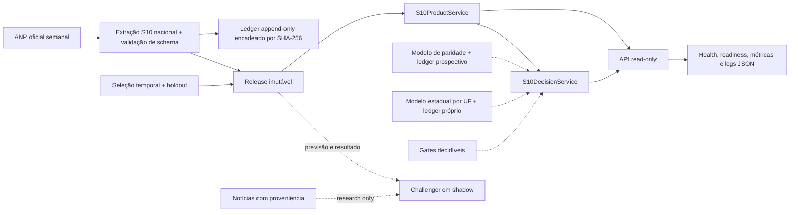

# Arquitetura do produto S10 Intelligence

## Princípio

O produto separa pesquisa, promoção e serving. Nenhuma requisição HTTP treina, atualiza ou promove modelos. A API carrega uma única release imutável, verifica seu SHA-256 antes de desserializar e recusa servir uma previsão vencida.

## Componentes

| Componente | Responsabilidade | Falha segura |
|---|---|---|
| `anp_official.py` | extrair uma observação Brasil/S10/R$/L e registrar hash da fonte | rejeita schema, unidade, geografia, data ou preço inesperado |
| `audit.py` | ledger canônico encadeado | rejeita conteúdo, sequência ou elo adulterado |
| `production.py` | ARIMA primário, intervalos, fallback e challenger | persistência em saída não finita/implausível |
| `product.py` | integridade, atualidade, evidência e cenários | readiness 503 quando a previsão vence |
| `api.py` | JSON dos modelos, autenticação, limites, headers, telemetria e OpenAPI | sem endpoints mutáveis nem frontend |
| `procurement.py` | replay causal de uma política pré-fixada | valida alinhamento origem/alvo e semanas sem gaps |
| `shadow.py` | avaliação prospectiva congelada | nunca promove automaticamente |
| `gates.py` | gates decidíveis: MAE, regime, Winkler, bootstrap em blocos, DM corrigido | limiares são argumentos, não constantes escondidas |
| `calibration.py` | nível do intervalo aprendido online (conformal adaptativo) | fallback gaussiano antes do aquecimento; `alpha` limitado e clipping registrado |
| `decision.py` | recomendação acionável e governança explícita | recusa decidir com release não apta; ignora challenger de outra semana-alvo |
| `pressure.py` | indicador antecedente produtor contra paridade | semana sem produtor vira pressão ausente, nunca pressão errada |
| `regional.py` | série estadual da ANP, produtor casado com a região e spread com correção de erro | recusa painéis sem semanas em comum; limite de variação limita magnitude sem cancelar direção |

## Fluxo semanal

1. Baixar a planilha da página institucional da ANP e conservar o arquivo bruto.
2. Executar `14_s10_ingest_official.py` apontando para uma saída nova; sobrescrita é recusada.
3. Conferir fonte, hash, erro, cobertura, fallback, health e round-trip.
4. Atualizar o shadow com a mesma planilha; data e preço são comparados ao conteúdo oficial.
5. Rodar a suíte completa e os smoke tests da API.
5.1. Reemitir a previsão de paridade (`23_s10_parity_production.py`): ela liquida a semana anterior no ledger prospectivo, recalibra o nível do intervalo e registra revisão quando o artefato muda.
6. Publicar a release por um ponteiro/registry da plataforma, mantendo rollback para o hash anterior.

## Escala

## Integridade além dos bytes

O SHA-256 garante que o artefato servido é o mesmo que foi publicado. Ele não garante que o runtime que desserializa esse artefato é o mesmo que o escreveu — e uma troca de versão de numpy, pandas ou scikit-learn muda resultado numérico em silêncio. A release registra `metadata.runtime_versions`; `S10ProductService` compara com o ambiente vivo e marca `degraded` com o motivo explícito quando diverge, sem bloquear, porque os bytes continuam íntegros e a previsão continua útil.

## Escala

O artefato atual é pequeno e a inferência é CPU-bound curta. Em container, cada worker carrega uma cópia em memória. Começar com um worker por container e escalar horizontalmente; somente depois de medir carga real decidir número de réplicas. TLS, autenticação de usuários, secrets, logs e alertas devem ser terminados/centralizados pela plataforma.
